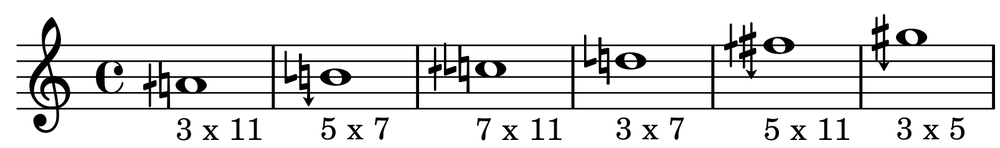
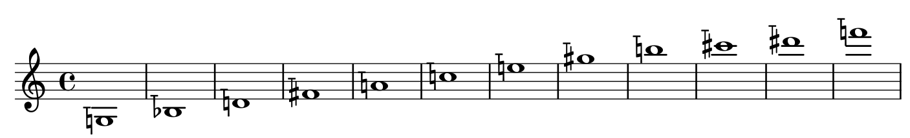

# Helmholtz-Ellis JI Notation for Lilypond

This package adds support for the [Extended Helmholtz-Ellis JI Pitch Notation](https://marsbat.space/pdfs/notation.pdf) in Lilypond via [Ekmelily](http://www.ekmelic-music.org/en/extra/ekmelily.htm) and the [Ekmelos font](http://www.ekmelic-music.org/en/extra/ekmelos.htm) from Thomas Richter.
For a basic introduction to microtonal composition and notation read [this article](https://marsbat.space/pdfs/JI.pdf).

## Installation

First follow the installation instructions of [Ekmelily](http://www.ekmelic-music.org/en/extra/ekmelily.htm#Installation) and [Ekmelos](http://www.ekmelic-music.org/en/extra/ekmelos.htm#Installation).
Then download the latest _ekme-heji.ily_ package.
You can either extract the ['ekme-heji.ily'](https://github.com/levinericzimmermann/ekme-heji.ily/blob/master/ekme-heji/ekme-heji.ily) file in the same directory as your Lilypond project, or you put it in Lilyponds installation directory (something like `lilypond/usr/share/lilypond/current/ly`).
Finally you have to include _ekme-heji.ily_ file in your Lilypond file:

```lilypond
\version "2.22.0"
\language "english"
\include "ekme-heji.ily"
```

## Usage and nomenclature

_ekme-heji.ily_ adds new pitches to Lilypond.
The pitch names are composed of three subparts:

| explanation | example 1 | example 2 |
| --------------- | --------------- | --------------- |
| diatonic pitch name | `a` | `c` |
| Pythagorean accidental | `s` (for 'sharp') | `ff` (for 'double flat')|
| additional commas | `oaa` | `ubaocb` |

Therefore `asoaa` and `cffubaocb` would be the concatenated full pitch names.

Additional commas are described by three letters:

| explanation | example 1 | example 2 |
| --------------- | --------------- | --------------- |
| tonality | `o` (for otonality) | `u` (for utonality) |
| prime number | `a` (for 5) | `c` (for 11) |
| exponent | `a` for +/- 1 | `b` for +/- 2 |

Tonality can either be [o for otonality or u for utonality](https://en.wikipedia.org/wiki/Otonality_and_Utonality) (if the exponent is bigger than 0 it's an otonality, if the exponent is smaller than 0 it's an utonality).

The prime number nomenclature is a simple mapping of the alphabetical order to rising prime numbers:

- 5 -> `a`
- 7 -> `b`
- 11 -> `c`
etc.

The exponent nomenclature is also a simple mapping of alphabetical order to rising integers:

- 1 -> `a`
- 2 -> `b`
- 3 -> `c`
etc.

Therefore a 5/4 pitch to c would be written as `eoaa` (diatonic pitch name: `e`, comma: `oaa` for otonality (= `o`) of 5 (= `a`) with exponent 1 (= `a`)).
When a pitch owns several commas they are always sorted from lower prime numbers to higher prime numbers.
For instance the diatonic pitch 'a' with two syntonic commas and one undecimal commas would be written as `aoaboca`.

Tempered pitches are indicated with the letter `t`.
For instance a tempered `d` would be `dt` and a tempered f-sharp would be `fst`.

## Examples

Writing a [Wilson Hexany](http://anaphoria.com/wilsoncps.html) in HEJI - Notation:

```lilypond
\version "2.22.0"
\language "english"

\include "ekme-heji.ily"

\new Score
<<
    \new Staff
    {
        \new Voice
        {
            \accidentalStyle "dodecaphonic"
            aoca'1
            boaaoba'
            cobaoca''
            doba''1
            fsoaaoca''1
            gsoaa''1
        }
    }
>>
```




Writing a [twelfth tone row](https://en.wikipedia.org/wiki/Violin_Concerto_(Berg)) of tempered pitches:

```lilypond
\version "2.22.0"
\language "english"

\include "ekme-heji.ily"

\new Score
<<
    \new Staff
    {
        \new Voice
        {
          \relative c'
          {
            gt1
            bft
            dt
            fst
            at
            ct
            et
            gst
            bt
            cst
            dst
            ft
        }
      }
    }
>>
```



## Precision

Midi playback is precise to within +/- 0.2 cents.

## Limitations

By default not all specified accidentals and accidental combinations are supported.
The highest implemented prime number is 17 although the [Helmholtz-Ellis JI Pitch Notation](https://marsbat.space/pdfs/notation.pdf) defines accidentals until 47.
There are two reasons for this limitation:

1. Lilypond takes too long to parse if all specified accidental combinations are added.
2. The [Ekmelos font](http://www.ekmelic-music.org/en/extra/ekmelos.htm) only supports accidentals until prime number 31. This could be solved in future releases of Ekmelos or through using a different font.

For now, _ekme-heji.ily_ is only available in English (English diatonic pitch names, English default accidentals like 's' for sharp and 'f' for flat).

## Modifications

If you want to build your own tuning files with different nomenclature or different supported prime numbers, you can adjust the Python script which builds the tuning files.
For running it, you first have to install [mutwo](https://github.com/mutwo-org/mutwo).
See [mutwos api documentation](https://mutwo.readthedocs.io/en/latest/mutwo/converters/frontends/mutwo.converters.frontends.ekmelily.html#module-mutwo.converters.frontends.ekmelily) for more information regarding the tuning file script.
